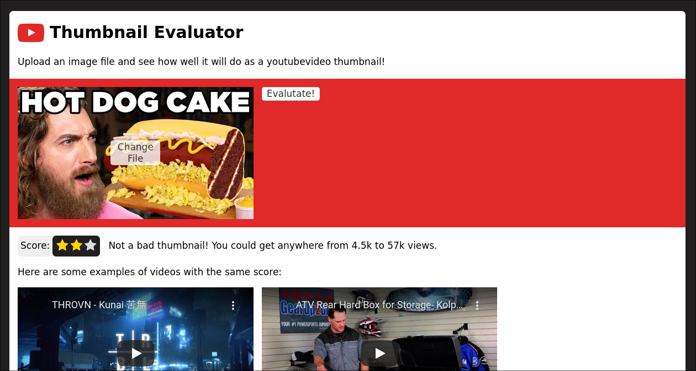

# Thumbnail Evaluator
This is a youtube thumbnail evaluator.

The trained model can be found [here](https://drive.google.com/file/d/1ZGIh5CFGrvGOk-0XkJDJTJfBV2bU85ct/view?usp=sharing).
Although the webapp works as intended, the model can definietely do with
some work as it currently only has a validation accuracy of around 0.4.
The model is a simpler Xception-based CNN.

## Screenshot

