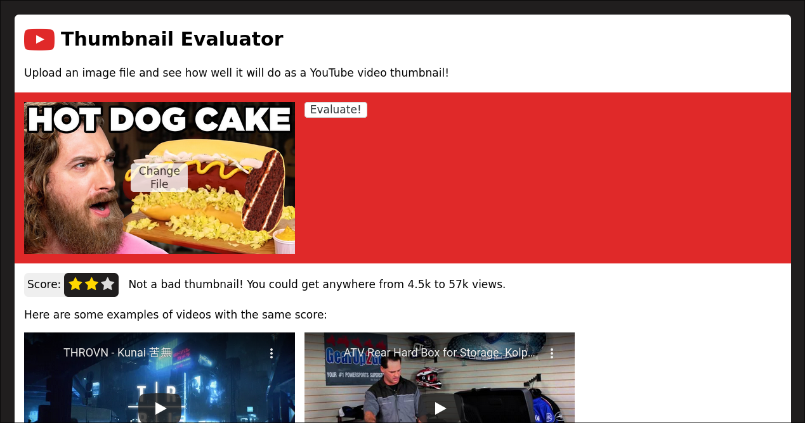

# Thumbnail Evaluator
This is a youtube thumbnail evaluator.

The trained model can be found [here](https://drive.google.com/file/d/1ZGIh5CFGrvGOk-0XkJDJTJfBV2bU85ct/view?usp=sharing).
Although the webapp works as intended, the model can definietely do with
some work as it currently only has a validation accuracy of around 0.4.
The model is a simpler Xception-based CNN.

## Screenshot


## Dependencies
Although you can probably get it to work on non-unix systems, this
project assumes it's running on Unix/Posix systems.

Required packages: `Python 3`, `Pipenv`

## Running
Request a YouTube API key
[here](https://console.developers.google.com/).

Create a `webapp/env.sh` file with the following content:
```sh
export YT_API_KEY="YOUR YOUTUBE API KEY HERE"
```

Download the pretrained model and place it in `webapp/static/model.h5`.

Finally to run the webapp:
```sh
$ cd webapp
$ pipenv install
$ pipenv run run-debug
```
